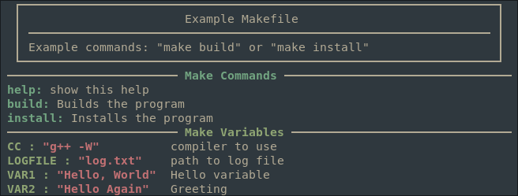

# Automatically document your Makefile!

This is a help target for GNU Makefiles that allows for automatic documentation. The magic code is:

```make
help: ## show this help
	@sed -ne "s/^##\(.*\)/\1/p" $(MAKEFILE_LIST)
	@printf "────────────────────────`tput bold``tput setaf 2` Make Commands `tput sgr0`────────────────────────────────\n"
	@sed -ne "/@sed/!s/\(^[^#?=]*:\).*##\(.*\)/`tput setaf 2``tput bold`\1`tput sgr0`\2/p" $(MAKEFILE_LIST)
	@printf "────────────────────────`tput bold``tput setaf 4` Make Variables `tput sgr0`───────────────────────────────\n"
	@sed -ne "/@sed/!s/\(.*\)?=\(.*\)##\(.*\)/`tput setaf 4``tput bold`\1:`tput setaf 5`\2`tput sgr0`\3/p" $(MAKEFILE_LIST)
	@printf "───────────────────────────────────────────────────────────────────────\n"

# remove if you want another default.
.DEFAULT_GOAL := help
```

Just throw this in your makefile and lines that start with `##` will now appear in the help.
Targets with `##` after them will show up in their own section of the help.
User settable variables with `##` after them will show up in their own sections.

The example Makefile in this repo will output this:


File an issue with any questions!
